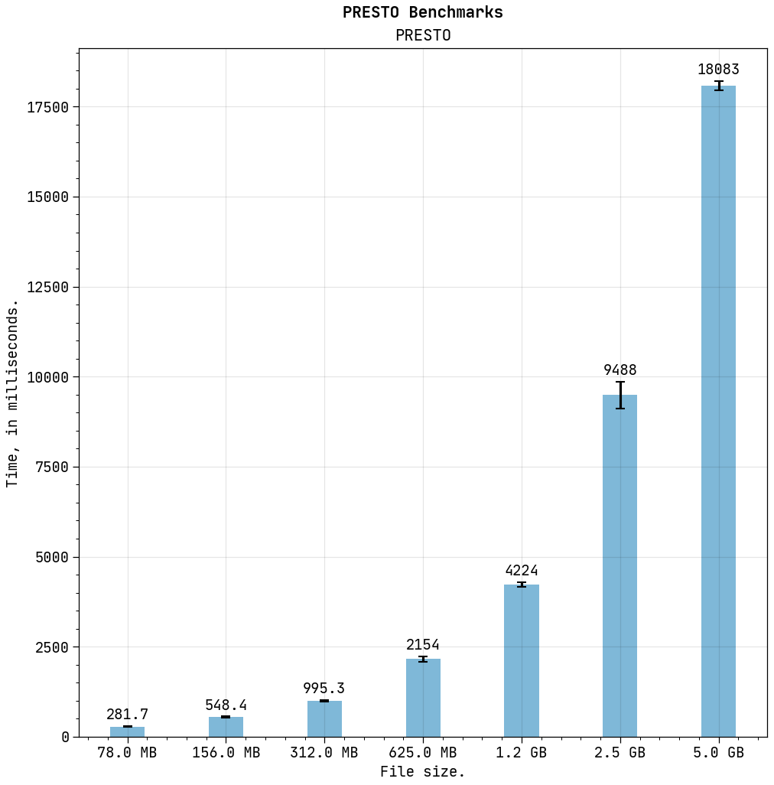

<div align="center"><h1>Benchmarks</h1></div><br/>

<div align="justify">

The files were simulated using the `fast_fake` and `inject_pulsar` command line utilities
that come with the `SIGPROC` package. The parameters of PSR J2144-3933 were used, with
the profile taken from the [**EPN Database of Pulsar Profiles**][epn], and the parameter
file taken from the [**ATNF Pulsar Catalogue**][atnf]. The pulsar's phases were simulated
using the `TEMPO` package, and then it was injected into white noise with a phase-averaged
SNR of 5. The sampling rate (**81.96** microseconds), the number of channels (**4096**),
and the frequency band (from **200** to **500** MHz) were all taken to be consistent with
the parameters of the [**GHRSS survey**][ghrss]. All files used to simulate the pulsar can
be found in this directory, including the predicted phases generated via `TEMPO`, which
can be found in the files [`pred.tim`](pred.tim) and [`t2pred.dat`](t2pred.dat), the pulsar
profile in [`dsb+98_436.txt`](dsb+98_436.txt), and the parameter file, taken from the ATNF
Pulsar Catalogue, in [`J2144-3933.par`](J2144-3933.par). They can be used to generate the
files used in the benchmark; for example, to generate the file with the smallest size in
this benchmark, the commands to execute would be:

```bash
tempo2 -f J2144-3933.par -pred "gmrt 58017 58018 500 300 9 9 300"
fast_fake -T 50 -t 81.96 -m 58017 -F 500.0 -f -0.048828125 -b 8 -c 128 >> noise.fil
inject_pulsar -s 5 -f 500 --pred t2pred.dat --prof dsb+98_436.txt file.fil > J2144-3933.fil
```

Files with a wide range of sizes were simulated, in order to study how both implementations
scale with the amount of data they have to process. To get files of different sizes, the
observation time and the number of channels were tweaked. All files store the data as 8 bit
integers, since that is the most common bitsize found in the wild for filterbank files.

[`PRESTO`][presto]'s `prepsubband` command was benchmarked as reference, using the amazing
[**hyperfine**][hyperfine]. In order to ensure that the I/O did not affect the timing of the
command, 3 warmup runs were carried out first to fill in the cache. The following command
line parameters were used for `prepsubband`:

```bash
prepsubband \
    -noclip \
    -nobary \
    -nsub 32 \
    -numdms 1 \
    -lodm 3.35 \
    -dmstep 0.0 \
    -downsamp 1 \
    -o fake \
    J2144-3933.fil
```

Note that data clipping and barycentering have been turned off, in order to try and get to the true
speed of the dedispersion algorithm itself. There could still be other processes preventing us from
getting to the speed of the actual algorithm, however. This benchmarked will be updated accordingly
if any such new information comes in.

The results of the benchmark were as follows:

<br/>



<br/>

**`PRESTO` Benchmarks**:

<div align="center">

|  File size  |  Number of channels  |  Observation time  |       Mean       |     Min    |    Max    |
|-------------|----------------------|--------------------|------------------|------------|-----------|
|     78 MB   |         128          |          50        |  281.7 ± 6.6 ms  |  273.7 ms  | 292.2 ms  |
|    156 MB   |         128          |         100        |  548.4 ± 13.6 ms |  526.0 ms  | 574.7 ms  |
|    312 MB   |         256          |         100        |  995.3 ± 29.9 ms |  963.5 ms  | 1062.8 ms |
|    625 MB   |         512          |         100        |  2.154 ± 0.074 s |  2.082 s   | 2.284 s   |
|    1.2 GB   |        1024          |         100        |  4.224 ± 0.072 s |  4.134 s   | 4.346 s   |
|    2.5 GB   |        2048          |         100        |  9.488 ± 0.368 s |  9.192 s   | 10.172 s  |
|    5.0 GB   |        4096          |         100        | 18.083 ± 0.132 s |  17.930 s  | 18.319 s  |

</div>

<br/>

**`DeDisp` Benchmarks**:

Coming soon.

<hr style="border-width:5px"/>

**NOTES**:

1. All data provided by the EPN Database of Pulsar Profiles comes under the
[**EPN Legacy Agreement**][epn_legacy_agreement]. In case you download this file, you
agree to follow the legacy EPN database agreement when publishing any work based on
this data. Please refer to [*D'Amico, N., Stappers, B. W., Bailes, M., Martin, C. E.,
Bell, J. F., Lyne, A. G. & Manchester, R. N., 1998, MNRAS, 297, p28-40*][prof_paper],
for further details and attribution.

2. Regarding the use of the ATNF Pulsar Catalogue and the data and software behind it, the
following statements apply (for more details, see [**this**][psrcat_download]):

    > PSRCAT is free software: you can redistribute it and/or modify it under the terms of the
    GNU General Public License as published by the Free Software Foundation, either version 3
    of the License, or (at your option) any later version. PSRCAT is distributed in the hope that
    it will be useful, but WITHOUT ANY WARRANTY; without even the implied warranty of MERCHANTABILITY
    or FITNESS FOR A PARTICULAR PURPOSE. See the GNU General Public License for more details.
    >
    > PSRCAT makes use of "evaluateExpression: A Simple Expression Evaluator". Copyright &copy; 1996 -
    1999 Parsifal Software, All Rights Reserved.
    >
    > The programs and databases remain the property of the Australia Telescope National Facility,
    CSIRO, and are covered by the [**CSIRO Legal Notice and Disclaimer**][csiro_legal_notice].
    >
    > If you make use of information from the ATNF Pulsar Catalogue in a publication, we would appreciate
    acknowledgement by reference to the publication "[**The ATNF Pulsar Catalogue**][atnf_paper]", R. N.
    Manchester, G. B. Hobbs, A. Teoh & M. Hobbs, Astronomical Journal, 129, 1993-2006 (2005) and by quoting
    the web address **http://www.atnf.csiro.au/research/pulsar/psrcat** for updated versions.

</div>

[epn]: http://www.epta.eu.org/epndb
[presto]: https://github.com/scottransom/presto
[hyperfine]: https://github.com/sharkdp/hyperfine
[atnf]: https://www.atnf.csiro.au/people/pulsar/psrcat
[ghrss]: http://www.ncra.tifr.res.in/~bhaswati/GHRSS.html
[prof_paper]: https://doi.org/10.1046/j.1365-8711.1998.01397.x
[atnf_paper]: http://adsabs.harvard.edu/abs/2005AJ....129.1993M
[csiro_legal_notice]: http://www.csiro.au/en/About/Footer/Legal-notice
[epn_legacy_agreement]: http://www.epta.eu.org/epndb/about.html#epn-legacy
[psrcat_download]: http://www.atnf.csiro.au/research/pulsar/psrcat/download.html
